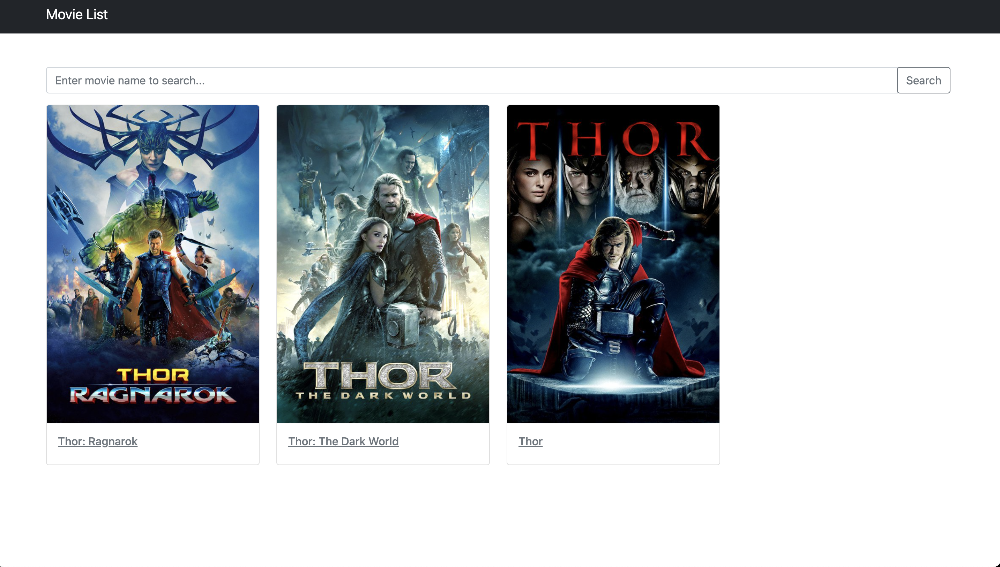

# Movie List

此專案提供電影清單列表，可以使用搜尋功能，搜尋喜愛的電影

## 功能列表
- 渲染電影清單畫面
- 搜尋功能搜尋喜愛電影

## 安裝
1.  ```git clone git@github.com:Kris3131/movieList.git```
2.  ```npm install```
3.  開啟 localhost >> ```npm run dev```

## 使用工具
- [Express@4.16.4](https://www.npmjs.com/package/express)
- [Express-Handlebars@3.0.0](https://www.npmjs.com/package/express-handlebars)
- [Bootstrap](https://getbootstrap.com/)

### 畫面截圖



